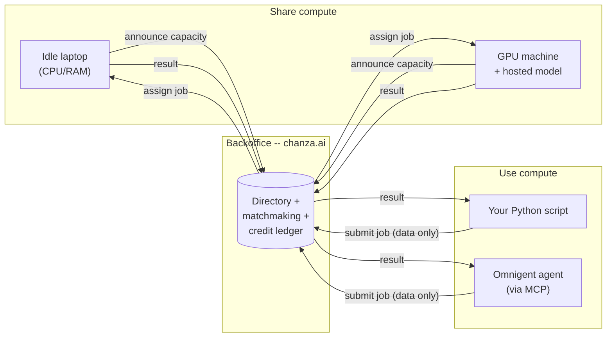
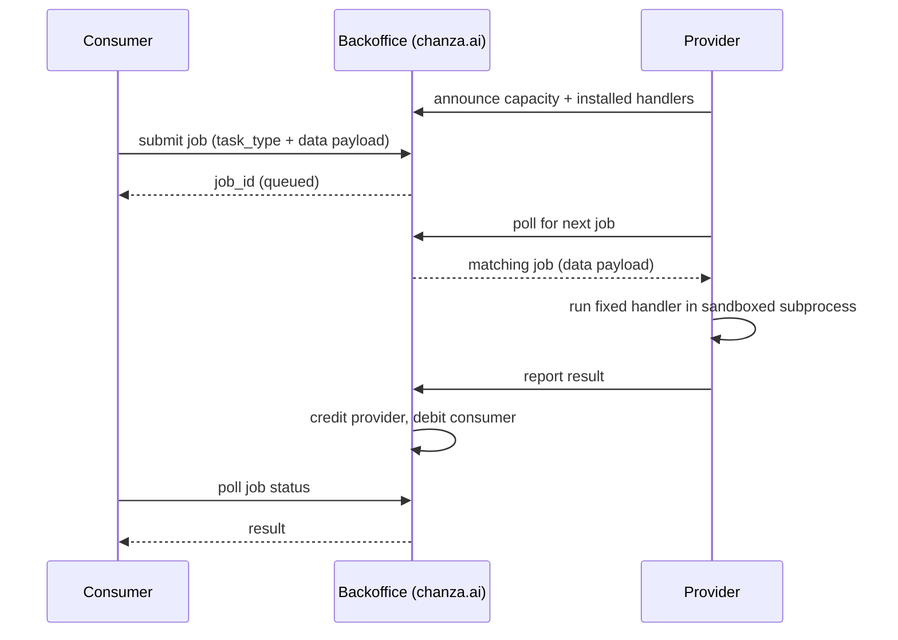
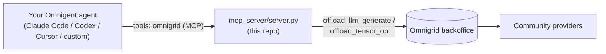

### Spare compute, shared like a signal -- not sold like a service.

In 1999, SETI@home let millions of ordinary computers donate their idle
CPU cycles to a single shared goal: sift through radio-telescope noise
for a signal that might mean we're not alone. It worked because giving
away spare compute cost nothing and the ledger of who'd contributed was
public and fair.

Omnigrid borrows that exact idea and points it somewhere new. The thing
worth searching for now isn't a signal from space -- it's more capacity
for the AI agents already running on our own machines. Donate a laptop's
idle CPU/RAM/GPU, or an open model you're already hosting, and it goes to
work for someone else's agent. Need more than your own machine has? Reach
into the same pool. No cloud bill, no plan tiers, no signup form --
installing the client *is* the account.

**Live network, dashboard, and credit leaderboard: [chanza.ai](https://chanza.ai)**

---

## The one rule everything else follows

**Nothing here ever runs code that someone else sends you.** A machine
sharing its compute only ever runs its own small set of fixed, pre-installed
functions (matrix ops, ONNX model inference, LLM text generation) on
*data* that arrives over the wire -- never a script, a shell command, or a
container image supplied by whoever's asking. That single rule is what
makes it safe to let a stranger's request run on your laptop at all, and
it's why there's no Docker, no VM, no sandboxing arms race anywhere in
this project: there's no untrusted code to contain in the first place.



## Share your compute

Install the client, tell it how much you're willing to give away, and
leave it running. It only picks up work while your machine looks idle.

```bash
git clone https://github.com/mexmarv/omnigrid.git
cd omnigrid/client
python3 -m venv .venv && source .venv/bin/activate
pip install -r requirements.txt

python3 agent.py --name "your name" --cpu-cores 2 --ram-mb 2048 \
    --coordinator https://chanza.ai
```

**Got a GPU?** It's used automatically. On Apple Silicon the client
detects Metal and offloads LLM layers to it; on NVIDIA it does the same
via CUDA; `onnx_infer` tries CoreML/CUDA first and only falls back to CPU
if neither is available. Verified for real on Apple Silicon -- llama.cpp's
own device-init log confirms all layers land on the GPU, not just assumed.

Have an open-weight GGUF model sitting around (Llama, Mistral, Qwen,
whatever)? Host it for text generation, GPU offload included:

```bash
python3 agent.py --name "your name" --cpu-cores 2 --ram-mb 2048 \
    --coordinator https://chanza.ai \
    --llm-model-path /path/to/model.gguf --llm-model-name my-model
```

The first run registers you an account (50 free credits to start) and
caches an API key at `~/.omnigrid/` -- there's no password or recovery,
so back that folder up if you care about keeping the identity. Every
job you complete earns credits from whoever consumed it; nobody has to
trust anybody, the ledger just tracks who's given what.

<details>
<summary>What actually happens when a job runs (sequence diagram)</summary>


</details>

## Use the network

**From your own Python script or notebook:**

```python
import client_sdk as cc
import numpy as np

result = cc.run_tensor_op("matmul", a, b, account_name="your name",
                           coordinator="https://chanza.ai")

text = cc.run_llm_infer("Explain BitTorrent in one sentence.",
                         model_name="some-hosted-model", account_name="your name",
                         coordinator="https://chanza.ai")
```

**From [Omnigent](https://github.com/omnigent-ai/omnigent)** (Databricks'
open-source meta-harness -- one agent definition, any harness: Claude Code,
Codex, Cursor, and more), point your agent at the network as an MCP tool:



Add three lines to your agent's YAML:

```yaml
tools:
  omnigrid:
    type: mcp
    command: python3
    args: ["/path/to/omnigrid/mcp_server/server.py"]
    env:
      OMNIGRID_ACCOUNT: "your name"
      OMNIGRID_HUB: "https://chanza.ai"
```

That gives the agent three tools: `list_models` (what's currently hosted),
`offload_llm_generate`, and `offload_tensor_op`. This is *not* a way to
share access to your paid Claude/Codex/etc. account or its credentials --
Omnigent's own session-sharing deliberately keeps those on your machine,
and this integration follows the same rule. It only ever reaches
self-hosted, open-weight models someone chose to donate.

## Run it yourself, right now

```bash
git clone https://github.com/mexmarv/omnigrid.git
cd omnigrid/backoffice
cp config.example.php config.php   # SQLite by default, nothing to edit
php -S 127.0.0.1:8000
```

That's a complete backoffice running locally -- open `http://127.0.0.1:8000`
for the dashboard. Full walkthrough (including wiring up a client against
it) in [backoffice/HOSTING.md](backoffice/HOSTING.md).

## Want to run your own network instead of chanza.ai?

The whole backoffice (directory + matchmaking + credit ledger) is plain
PHP, defaulting to SQLite -- one file, nothing to provision, upload it to
any shared host. See [backoffice/HOSTING.md](backoffice/HOSTING.md).

## Honest limitations -- read before relying on this for anything serious

- **Job results are readable by anyone who knows the job_id.** There's no
  auth on reading a job's payload/result yet. Fine for non-sensitive data;
  don't send anything private through the network until this is fixed.
- **No rate limiting.** An account can currently submit as fast as it wants.
- **No transport encryption is enforced by the code itself** -- put this
  behind HTTPS (Hostinger's free AutoSSL, or any reverse proxy) before
  running it for real. chanza.ai already does.
- **The LLM handler reloads the model from disk on every job** (each job
  runs in a fresh sandboxed subprocess). Fine for small models; a
  persistent warm worker per model would be the real fix.
- **GPU support is verified on Apple Silicon; the CUDA path is untested**
  on real NVIDIA hardware here (it uses the same llama-cpp-python/onnxruntime
  mechanism, and falls back safely if unavailable, but hasn't been run on
  an NVIDIA box). If you test it, contributions/reports welcome.
- **No redundancy/consensus on results.** A job runs on exactly one
  provider and its answer is taken on faith -- fine when you can sanity-check
  the result yourself, risky if you need to trust a stranger blindly.
- **This has not had an independent security review.** The "never run
  remote code" principle is sound by design, but the implementation
  hasn't been audited. Treat this as a working, tested prototype -- not
  a hardened public service, yet.

## How it's actually built

Providers run a small, fixed set of audited handlers (`client/handlers/`):
`tensor_op` (six safe numpy operations), `onnx_infer` (a supplied ONNX
model, data-only, CoreML/CUDA-accelerated when available), `llm_infer`
(text generation against a model the *provider* chose to host, GPU-offloaded
when available -- the model itself never crosses the wire, only prompts
and generation params do). Every job still runs in its own OS subprocess
with a wall-clock timeout and memory cap, purely to contain crashes -- not
as a security boundary, since there's nothing untrusted to contain.
Accounts authenticate with an API key (no password, no email); the
backoffice enforces that you can only announce as, or report results for,
providers you actually own.
