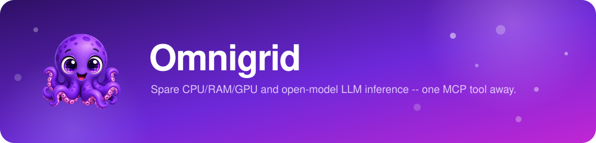
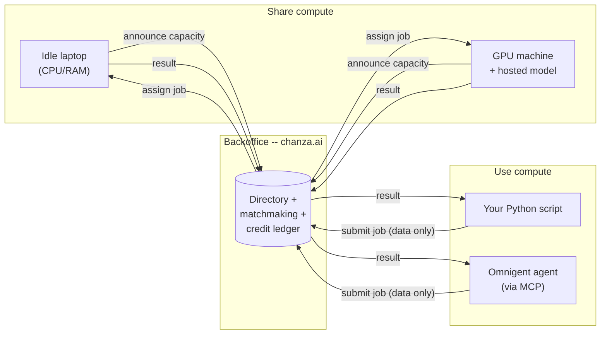
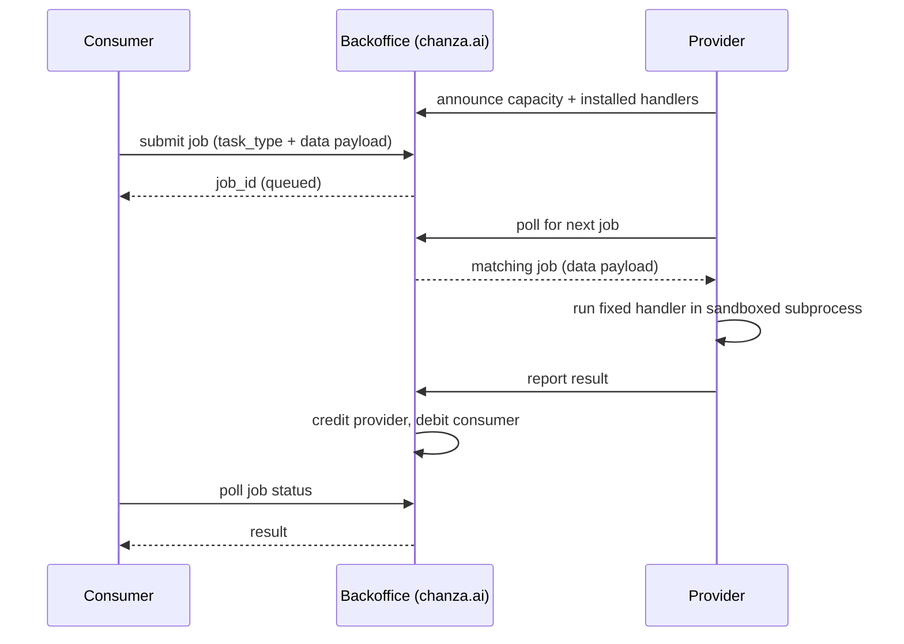

<p align="center">
  
</p>

<p align="center">
  <a href="https://chanza.ai"><b>Live network &amp; dashboard</b></a> ·
  <a href="https://chanza.ai/register.php">Get an API key</a> ·
  <a href="#use-it-right-now">Use it right now</a> ·
  <a href="backoffice/HOSTING.md">Self-host it</a>
</p>

---

In 1999, SETI@home let millions of ordinary computers donate their idle
CPU cycles to a single shared goal: sift through radio-telescope noise
for a signal that might mean we're not alone. It worked because giving
away spare compute cost nothing and the ledger of who'd contributed was
public and fair.

Omnigrid borrows that exact idea and points it somewhere new. The thing
worth searching for now isn't a signal from space -- it's more capacity
for the AI agents already running on our own machines. Donate a laptop's
idle CPU/RAM/GPU, or an open model you're already hosting, and it goes to
work for someone else's agent. Need more than your own machine has? Reach
into the same pool. No cloud bill, no plan tiers, no signup form --
installing the client *is* the account.

## Use it right now

No installing anything to *consume* the network -- pick whatever you
already use below. Two steps apply no matter which one you pick:

**1. Get an account and API key.** Visit `https://chanza.ai/register.php`
(or `http://127.0.0.1:8000/register.php` if you're running your own
backoffice -- see [Self-host your own network](#self-host-your-own-network-instead-of-chanzaai)
below), pick a name and email, and you'll get an API key shown once --
save it.

**2. Check what's actually available.** The dashboard lists every model
currently hosted for free under "Being shared for free, right now" --
that's what you ask for by name once it's wired up.

**3. Pick your client** and add the config below (all point at the same
`https://chanza.ai/mcp.php`, or your own backoffice's URL if self-hosting):

<details>
<summary> <b>Omnigent</b> -- open-source meta-harness</summary>

**Connect a host first, or nothing below will actually run.** Omnigent
sessions execute on a "host" -- your own machine, or a Databricks-managed
cloud sandbox -- not directly in the chat UI itself. If you haven't
connected one yet (Omnigent's "Connect a host" dialog, or a blank host
menu when starting a session, is the tell), install the CLI and register
your machine as one:

```bash
curl -fsSL https://omnigent.ai/install.sh | sh -s -- --extra "databricks"
omni setup
omni login <your-workspace-url>
omni host --server <your-workspace-url>
```

(`<your-workspace-url>` is the same `https://adb-....azuredatabricks.net`
URL Omnigent's own "Connect a host" dialog shows you, pre-filled into that
exact command.) Keep that process running, pick the host it registers
from the session's host menu, *then* wire up the MCP tool below.

**Pick a harness for the session** -- Claude SDK, Codex, Cursor, Antigravity,
and others are all valid engines to run the agent itself; omnigrid is just
an MCP tool that plugs into whichever one you pick. Confirmed working
end-to-end on Antigravity specifically -- a real `offload_llm_generate`
call completed against a live provider through it.

**Expect an approval prompt the first time each tool is actually called** --
`list_models`, `offload_llm_generate`, and `offload_tensor_op` each show up
as their own tool in Omnigent's policy system, and the default policy is to
pause and ask before a *new* tool's first call, not to auto-allow it. If
every single call keeps re-asking rather than just the first one, that's
usually the harness failing to persist the tool registration (e.g. a
global config write outside your project directory getting silently
denied by the sandbox) rather than anything wrong with omnigrid itself.

Omnigent has an actual **Create custom agent** form -- Name, Description,
Harness, Model, System instructions, and an **MCP Tools &rarr; + Add
server** button at the bottom. Clicking it opens a server-name field, a
transport dropdown (defaults to **stdio**), then command/args/environment
fields for that transport. Those stdio fields map directly onto this
repo's local MCP server -- confirmed, not a guess:

```
server-name:  omnigrid
command:      python3
args:         /path/to/omnigrid/mcp_server/server.py
env:          OMNIGRID_API_KEY=your-api-key
              OMNIGRID_HUB=https://chanza.ai
```

That runs `mcp_server/server.py` as a local process alongside Omnigent --
needs Python and this repo checked out wherever Omnigent runs. If that
dropdown also offers an HTTP option (not yet confirmed), the hosted
endpoint should work there the same way it does in every other client
in this list:

```
URL:     https://chanza.ai/mcp.php
Header:  Authorization: Bearer your-api-key
```

Prefer describing it instead of clicking through the form? Omnigent is chat-first
too -- paste this into its "Describe a task to start a new session..."
box and it authors the config for you (swap in your real key from
[chanza.ai/register.php](https://chanza.ai/register.php) -- that page
gives you this exact prompt pre-filled):

```
Set up a new agent with an MCP tool called "omnigrid" over HTTP, pointing
at https://chanza.ai/mcp.php, with an Authorization header set to
"Bearer your-api-key". It should be able to call list_models,
offload_llm_generate, and offload_tensor_op through that tool.
```

Prefer hand-editing the agent file yourself? Here's the equivalent YAML:

```yaml
name: my_agent
prompt: |
  You are a helpful assistant with access to the Omnigrid community
  compute network via the omnigrid tool.
executor:
  harness: claude-sdk   # or codex, cursor, antigravity, etc. -- whatever you're using
  model: your-model-here
tools:
  omnigrid:
    type: mcp
    url: "https://chanza.ai/mcp.php"
    headers:
      Authorization: "Bearer your-api-key"
```

Prefer a local process over the hosted endpoint (fully private setup, no
network hop)? `mcp_server/server.py` does the same tools over stdio --
requires Python + this repo checked out locally:

```yaml
tools:
  omnigrid:
    type: mcp
    command: python3
    args: ["/path/to/omnigrid/mcp_server/server.py"]
    env:
      OMNIGRID_API_KEY: "your-api-key"
      OMNIGRID_HUB: "https://chanza.ai"
```
</details>

<details>
<summary></summary>

```bash
claude mcp add --transport http omnigrid https://chanza.ai/mcp.php \
  --header "Authorization: Bearer your-api-key"
```

Or add it directly to `.mcp.json` (project scope, shareable via git) or
`~/.claude.json` (user scope):

```json
{
  "mcpServers": {
    "omnigrid": {
      "type": "http",
      "url": "https://chanza.ai/mcp.php",
      "headers": { "Authorization": "Bearer your-api-key" }
    }
  }
}
```
</details>

<details>
<summary></summary>

Remote MCP servers are added through the UI, not a config file:
**Settings &rarr; Connectors &rarr; Add custom connector**, URL
`https://chanza.ai/mcp.php`, then open **Request headers** and add
`Authorization: Bearer your-api-key`. (Team/Enterprise: an org owner adds
it once under **Organization settings &rarr; Connectors**, everyone else
just connects.)

Note: Anthropic's own docs describe custom request-header auth as a beta
feature being rolled out gradually -- if you don't see that option yet,
it may not be enabled for your account.
</details>

<details>
<summary></summary>

Add to `.cursor/mcp.json` (project) or `~/.cursor/mcp.json` (global):

```json
{
  "mcpServers": {
    "omnigrid": {
      "url": "https://chanza.ai/mcp.php",
      "headers": { "Authorization": "Bearer ${env:OMNIGRID_API_KEY}" }
    }
  }
}
```
</details>

<details>
<summary></summary>

Add to `~/.codex/config.toml` (or `.codex/config.toml` for a trusted project):

```toml
[mcp_servers.omnigrid]
url = "https://chanza.ai/mcp.php"
http_headers = { Authorization = "Bearer your-api-key" }
```
</details>

<details>
<summary></summary>

ChatGPT's connectors (Settings &rarr; Connectors, needs Developer Mode
enabled, paid plans only) do support adding a remote MCP server by URL --
but as far as we could confirm, the UI currently only offers **OAuth or
no authentication**, with no field for a static bearer token or custom
header the way Claude Code/Desktop, Cursor, and Codex CLI all have. That
means there isn't currently a clean way to point ChatGPT directly at
`mcp.php`'s API-key auth. If that's changed or we've got this wrong,
please open an issue -- happy to add real instructions once there's a
supported path.
</details>

<details>
<summary></summary>

```bash
git clone https://github.com/mexmarv/omnigrid.git
cd omnigrid/client
python3 -m venv .venv && source .venv/bin/activate
pip install -r requirements.txt
```

```python
import client_sdk as cc
import numpy as np

result = cc.run_tensor_op("matmul", a, b, api_key="your-api-key",
                           coordinator="https://chanza.ai")

text = cc.run_llm_infer("Explain BitTorrent in one sentence.",
                         model_name="some-hosted-model", api_key="your-api-key",
                         coordinator="https://chanza.ai")

# No key yet? Pass account_name="..." and email="..." instead of api_key=
# and it registers automatically on first use.
```
</details>

**4. Ask for the shared resource by name**, in plain language, in whichever
client you just wired up:

> List the models available on Omnigrid, then use whichever one is hosted
> to write a two-sentence summary of why octopuses are considered
> intelligent.

That one calls `list_models` then `offload_llm_generate`. **For an image plus
text, use `offload_vlm_generate` instead** -- `offload_llm_generate` is
text-only and has no field for an image at all, so asking for it by name
on an image prompt just silently drops the picture:

> Use Omnigrid's offload_vlm_generate to have `<model-name>` explain what's
> in this image.

Whether the image data actually reaches the tool call depends on whether
your harness bridges attached images into MCP tool arguments as base64 --
not every harness does. If the response describes the image correctly,
it worked; if it hallucinates or the tool errors on a missing/empty
image field, ask it explicitly to "read the image file, base64-encode it,
and pass that as image_b64" instead of relying on the attachment alone.

For raw compute instead of text generation -- no model, no GPU required
from anyone -- the same tool call pattern works for `offload_tensor_op` too:

> Use the omnigrid tool to compute the matrix product of [[1, 2], [3, 4]]
> and [[5, 6], [7, 8]].

Either way, if the provider is slow to respond, the tool returns a
`job_id` instead of making the agent (or you) wait indefinitely -- the
agent calls `check_job_result` with it, as many times as it takes, until
the answer's ready. The result comes back into your conversation like any
other tool result -- the compute for it just happened on someone else's
machine.

This is *not* a way to share access to your paid Claude/Codex/etc. account
or its credentials -- Omnigent's own session-sharing deliberately keeps
those on your machine, and this integration follows the same rule. It only
ever reaches self-hosted, open-weight models someone chose to donate.

---

## The one rule everything else follows

**Nothing here ever runs code that someone else sends you.** A machine
sharing its compute only ever runs its own small set of fixed, pre-installed
functions (matrix ops, ONNX model inference, LLM text generation) on
*data* that arrives over the wire -- never a script, a shell command, or a
container image supplied by whoever's asking. That single rule is what
makes it safe to let a stranger's request run on your laptop at all, and
it's why there's no Docker, no VM, no sandboxing arms race anywhere in
this project: there's no untrusted code to contain in the first place.



## What you can share

Three resources, all optional, all combinable on one machine:

| Resource | What runs on it | How it's used |
|---|---|---|
| **CPU + RAM** | `tensor_op` (matmul/add/multiply/relu/sum/mean), `onnx_infer` (any supplied ONNX model) | Baseline -- every provider offers this, no GPU required. |
| **GPU** | `onnx_infer` and `llm_infer` | Detected automatically and used without extra config -- see below. Not yet wired up for `tensor_op` (still plain CPU numpy there; honest gap, not a hidden one). |
| **An LLM you already have** (any GGUF file -- Llama, Mistral, Qwen, whatever) | `llm_infer` | You host one specific model under a name of your choosing; only prompts and generation params ever cross the wire, never the model itself. |
| **A free NVIDIA-hosted vision-language model** (your own [build.nvidia.com](https://build.nvidia.com) API key -- no local model, no local GPU needed) | `vlm_infer` | You relay prompts (and optionally images) to NVIDIA's free NIM API using your own key; only that key ever leaves your machine, never through chanza.ai or to whoever's consuming it. |

**How the GPU actually gets used**, concretely:
- `onnx_infer` tries execution providers in order -- **CoreML** (Apple Silicon), then **CUDA** (NVIDIA), then falls back to plain CPU if neither is compiled into the installed `onnxruntime`. This applies automatically to any ONNX job your machine picks up, no flag needed.
- `llm_infer` passes `n_gpu_layers` to `llama.cpp` -- `-1` (offload every layer) by default when a GPU is detected, override with `--gpu-layers` if you want partial offload to save VRAM for something else.
- Verified for real on Apple Silicon: `llama.cpp`'s own device-init log confirms every layer actually lands on the Metal GPU, not just assumed from a flag being set. The CUDA path uses the identical mechanism but hasn't been run on real NVIDIA hardware here -- reports/contributions welcome if you test it.

## What you actually get to call

That's the supply side (what a provider offers). On the demand side, this
is the entire menu -- every one of these is a live network call to
whichever provider currently has that resource:

| Operation | Python (`client_sdk`) | MCP tool (Omnigent/Claude/etc.) | Does what |
|---|---|---|---|
| List what's hosted | -- (check the dashboard) | `list_models` | Names of LLM models currently being shared for free. |
| Generate text | `run_llm_infer(...)` | `offload_llm_generate` | Text-only -- no image field. Runs your prompt on a community-hosted model's CPU/GPU. |
| Generate from text (+ optional image) | `run_vlm_infer(...)` | `offload_vlm_generate` | Use this one, not `offload_llm_generate`, whenever an image is involved. |
| Run a tensor op | `run_tensor_op(...)` | `offload_tensor_op` | matmul/add/multiply/relu/sum/mean on someone's spare CPU. |
| Run an ONNX model | `run_onnx_infer(...)` | -- (Python only for now) | Runs a model *you* supply on someone else's CPU/GPU. |
| Check a slow job | -- (handled for you) | `check_job_result` | Only needed if a job didn't finish immediately -- see above. |

That's the whole surface area. Nothing here is a general-purpose remote
shell or a way to run arbitrary code -- these four operations, and
whatever a provider's own machine decides to do with the data it's handed,
are the entire vocabulary of the network.

## Share your compute

Install the client, tell it how much you're willing to give away, and
leave it running. It only picks up work while your machine looks idle.

```bash
git clone https://github.com/mexmarv/omnigrid.git
cd omnigrid/client
python3 -m venv .venv && source .venv/bin/activate
pip install -r requirements.txt

python3 agent.py --name "your name" --email "you@example.com" --cpu-cores 2 --ram-mb 2048 \
    --coordinator https://chanza.ai
```

Already have an API key from [chanza.ai/register.php](https://chanza.ai/register.php)?
Skip `--name`/`--email` and pass `--api-key` directly instead.

Have an open-weight GGUF model sitting around? Host it for text
generation, GPU offload included automatically:

```bash
python3 agent.py --name "your name" --email "you@example.com" --cpu-cores 2 --ram-mb 2048 \
    --coordinator https://chanza.ai \
    --llm-model-path /path/to/model.gguf --llm-model-name my-model
```

No GGUF file and no GPU, but you do have a free [build.nvidia.com](https://build.nvidia.com)
API key? Share that instead -- no local model or GPU required at all,
since the actual inference runs on NVIDIA's own infrastructure. This is
the one resource here that's *just* a credential relaying an HTTP call,
not real local compute -- which means it doesn't need a client process
running on a machine you leave on:

- **Run your own backoffice (e.g. self-hosting per below)?** Add an
  `nvidia_models` entry to `config.php` (see `config.example.php`) and
  you're done -- the backoffice itself relays to NVIDIA directly, the key
  never leaves that server, and it shows up in `list_models` with zero
  separate processes running.
- **Using someone else's backoffice (e.g. chanza.ai) instead?** Run the
  client, same as any other resource -- this one just happens not to need
  real CPU/RAM behind it:

  ```bash
  python3 agent.py --name "your name" --email "you@example.com" --cpu-cores 1 --ram-mb 512 \
      --coordinator https://chanza.ai \
      --nvidia-api-key "nvapi-your-own-key" --nvidia-model-name my-vision-model
  ```

Either way, defaults to `meta/llama-3.2-90b-vision-instruct` -- a free,
general vision-language model capable of image recognition (object/scene
identification, describing what's happening in a photo, including sports
and activities) -- override with `--nvidia-model-id` (client) or
`model_id` (config.php) to point at a different one from NVIDIA's
[catalog](https://build.nvidia.com/models). The key never crosses the
network to whoever's consuming the model, either way. NVIDIA's free tier
is rate-limited (historically around 40 requests/minute); expect
`check_job_result` polling to take a little longer under heavy use rather
than a hard failure.

The first run registers you an account (50 free credits to start) and
caches an API key at `~/.omnigrid/` -- no password, ever. Your email is
only used by [reset.php](https://chanza.ai/reset.php) if you ever need to
reissue a lost key or delete the account; back up `~/.omnigrid/` if you'd
rather not rely on that. Every job you complete earns credits from
whoever consumed it -- **bragging rights only, not a spendable balance.**
Nothing anywhere checks your credit total before letting you submit a job;
it's a leaderboard, not a currency, and nobody has to trust anybody
either way -- the ledger just tracks who's given what.

<details>
<summary>What actually happens when a job runs (sequence diagram)</summary>


</details>

## Self-host your own network instead of chanza.ai

The whole backoffice (directory + matchmaking + credit ledger) is plain
PHP, defaulting to SQLite -- one file, nothing to provision, upload it to
any shared host.

```bash
git clone https://github.com/mexmarv/omnigrid.git
cd omnigrid/backoffice
cp config.example.php config.php   # SQLite by default, nothing to edit
php -S 127.0.0.1:8000
```

That's a complete backoffice running locally -- open `http://127.0.0.1:8000`
for the dashboard. Full walkthrough (Hostinger or any shared PHP host,
plus wiring a client against it) in [backoffice/HOSTING.md](backoffice/HOSTING.md).

## Honest limitations -- read before relying on this for anything serious

- **Job results are readable by anyone who knows the job_id.** There's no
  auth on reading a job's payload/result yet via the plain REST API
  (`GET /api/jobs_get.php`); the MCP tools do check ownership, that route
  doesn't yet. Fine for non-sensitive data; don't send anything private
  through the network until this is fixed.
- **No rate limiting.** An account can currently submit as fast as it wants.
- **Reset emails use PHP's built-in `mail()`.** It works out of the box on
  most shared hosting, but deliverability to Gmail/Outlook etc. without
  proper SPF/DKIM records can be spotty. If reset links aren't arriving,
  that's the first thing to check -- not a bug in the reset logic itself.
- **No transport encryption is enforced by the code itself** -- put this
  behind HTTPS (Hostinger's free AutoSSL, or any reverse proxy) before
  running it for real. chanza.ai already does.
- **The LLM handler reloads the model from disk on every job** (each job
  runs in a fresh sandboxed subprocess). Fine for small models; a
  persistent warm worker per model would be the real fix.
- **`tensor_op` doesn't use the GPU yet** -- plain numpy on CPU, even on a
  provider with a GPU sitting idle. `onnx_infer` and `llm_infer` both do;
  extending `tensor_op` (e.g. via PyTorch on CUDA/MPS) is a natural next
  step, not done yet.
- **No redundancy/consensus on results.** A job runs on exactly one
  provider and its answer is taken on faith -- fine when you can sanity-check
  the result yourself, risky if you need to trust a stranger blindly.
- **This has not had an independent security review.** The "never run
  remote code" principle is sound by design, but the implementation
  hasn't been audited. Treat this as a working, tested prototype -- not
  a hardened public service, yet.

## How it's actually built

Providers run a small, fixed set of audited handlers (`client/handlers/`):
`tensor_op` (six safe numpy operations), `onnx_infer` (a supplied ONNX
model, data-only, CoreML/CUDA-accelerated when available), `llm_infer`
(text generation against a model the *provider* chose to host, GPU-offloaded
when available -- the model itself never crosses the wire, only prompts
and generation params do). Every job still runs in its own OS subprocess
with a wall-clock timeout and memory cap, purely to contain crashes -- not
as a security boundary, since there's nothing untrusted to contain.
Accounts authenticate with an API key, never a password -- email is
collected only so `reset.php` can send a one-time link to reissue a lost
key or delete the account. The backoffice enforces that you can only
announce as, or report results for, providers you actually own.

Two ways to reach it as an MCP tool, both exposing the same tools:
`mcp_server/server.py` (Python, stdio, run locally) and `backoffice/mcp.php`
(hosted, HTTP) -- the latter hand-implements the JSON-RPC subset of MCP's
Streamable HTTP transport needed for a stateless tools-only server (no
session state, no SSE), including a from-scratch but numpy-byte-verified
encoder/decoder for the `.npy` tensor format so `offload_tensor_op`'s
payloads are readable by the same Python `tensor_op` handler every other
path uses. Long-running jobs never rely on a host's execution-time limit:
every HTTP request to `mcp.php` stays short (a few seconds) no matter what,
returning a `job_id` to keep polling via `check_job_result` instead of
blocking indefinitely -- verified against real, deliberately slow jobs,
not just fast ones that would hide the problem.
