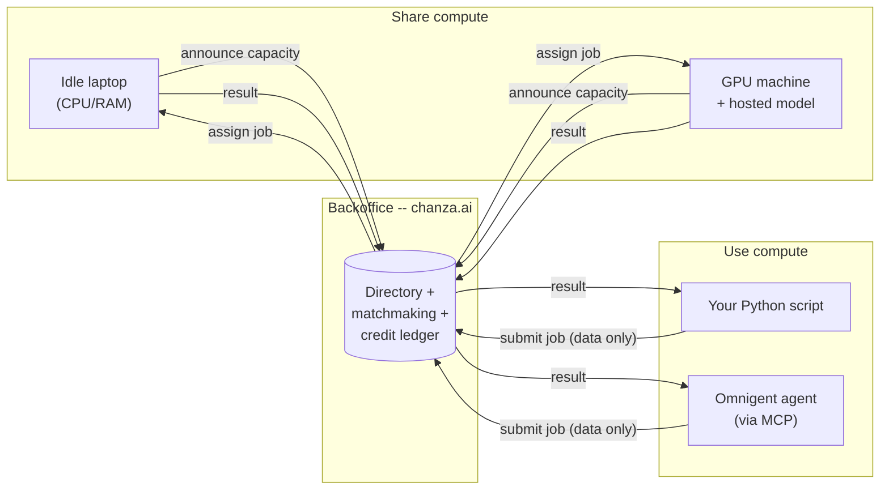

<p align="center">
  
</p>

<p align="center">
  <a href="https://chanza.ai"><b>Live network &amp; dashboard</b></a> ·
  <a href="https://chanza.ai/register.php">Get an API key</a> ·
  <a href="#use-it-right-now">Use it right now</a> ·
  <a href="backoffice/HOSTING.md">Self-host it</a>
</p>

---

<p align="center">
  
</p>

In 1999, SETI@home let millions of ordinary computers donate their idle
CPU cycles to a single shared goal: sift through radio-telescope noise
for a signal that might mean we're not alone. It worked because giving
away spare compute cost nothing and the ledger of who'd contributed was
public and fair.

Omnigrid borrows that exact idea and points it somewhere new. The thing
worth searching for now isn't a signal from space -- it's more capacity
for the AI agents already running on our own machines. Donate a laptop's
idle CPU/RAM/GPU, or an open model you're already hosting, and it goes to
work for someone else's agent. Need more than your own machine has? Reach
into the same pool. No cloud bill, no plan tiers, no signup form --
installing the client *is* the account.

## Use it right now

No installing anything to *consume* the network -- pick whatever you
already use below. Two steps apply no matter which one you pick:

**1. Get an account and API key.** Visit `https://chanza.ai/register.php`
(or `http://127.0.0.1:8000/register.php` if you're running your own
backoffice -- see [Self-host your own network](#self-host-your-own-network-instead-of-chanzaai)
below), pick a name and email, and you'll get an API key shown once --
save it.

**2. Check what's actually available.** The dashboard lists every model
currently hosted for free under "Being shared for free, right now" --
that's what you ask for by name once it's wired up.

**3. Pick your client** and add the config below (all point at the same
`https://chanza.ai/mcp.php`, or your own backoffice's URL if self-hosting):

<details>
<summary> <b>Omnigent</b> -- open-source meta-harness</summary>

**Connect a host first, or nothing below will actually run.** Omnigent
sessions execute on a "host" -- your own machine, or a Databricks-managed
cloud sandbox -- not directly in the chat UI itself. If you haven't
connected one yet (Omnigent's "Connect a host" dialog, or a blank host
menu when starting a session, is the tell), install the CLI and register
your machine as one:

```bash
curl -fsSL https://omnigent.ai/install.sh | sh -s -- --extra "databricks"
omni setup
omni login <your-workspace-url>
omni host --server <your-workspace-url>
```

(`<your-workspace-url>` is the same `https://adb-....azuredatabricks.net`
URL Omnigent's own "Connect a host" dialog shows you, pre-filled into that
exact command.) Keep that process running, pick the host it registers
from the session's host menu, *then* wire up the MCP tool below.

**Pick a harness for the session** -- Claude SDK, Codex, Cursor, Antigravity,
and others are all valid engines to run the agent itself; omnigrid is just
an MCP tool that plugs into whichever one you pick. Confirmed working
end-to-end on Antigravity specifically -- a real `offload_llm_generate`
call completed against a live provider through it.

**Expect an approval prompt the first time each tool is actually called** --
`list_models`, `offload_llm_generate`, and `offload_tensor_op` each show up
as their own tool in Omnigent's policy system, and the default policy is to
pause and ask before a *new* tool's first call, not to auto-allow it. If
every single call keeps re-asking rather than just the first one, that's
usually the harness failing to persist the tool registration (e.g. a
global config write outside your project directory getting silently
denied by the sandbox) rather than anything wrong with omnigrid itself.

Omnigent has an actual **Create custom agent** form -- Name, Description,
Harness, Model, System instructions, and an **MCP Tools &rarr; + Add
server** button at the bottom. The agent's own **Name** field can be
anything you like (e.g. `my-omnigrid-agent`) -- it only labels the agent
in your session list, it doesn't affect the tool connection. What matters
is the **+ Add server** button: clicking it opens a server-name field
(use `omnigrid`), a transport dropdown (defaults to **stdio**), then
command/args/environment fields for that transport. Those stdio fields
map directly onto this repo's local MCP server -- confirmed, not a guess:

```
server-name:  omnigrid
command:      python3
args:         /path/to/omnigrid/mcp_server/server.py
env:          OMNIGRID_API_KEY=your-api-key
              OMNIGRID_HUB=https://chanza.ai
```

That runs `mcp_server/server.py` as a local process alongside Omnigent --
needs Python and this repo checked out wherever Omnigent runs. If that
dropdown also offers an HTTP option (not yet confirmed), the hosted
endpoint should work there the same way it does in every other client
in this list:

```
URL:     https://chanza.ai/mcp.php
Header:  Authorization: Bearer your-api-key
```

Prefer describing it instead of clicking through the form? Omnigent is chat-first
too -- paste this into its "Describe a task to start a new session..."
box and it authors the config for you (swap in your real key from
[chanza.ai/register.php](https://chanza.ai/register.php) -- that page
gives you this exact prompt pre-filled):

```
Set up a new agent with an MCP tool called "omnigrid" over HTTP, pointing
at https://chanza.ai/mcp.php, with an Authorization header set to
"Bearer your-api-key". It should be able to call list_models,
offload_llm_generate, and offload_tensor_op through that tool.
```

Prefer hand-editing the agent file yourself? Here's the equivalent YAML:

```yaml
name: my_agent
prompt: |
  You are a helpful assistant with access to the Omnigrid community
  compute network via the omnigrid tool.
executor:
  harness: claude-sdk   # or codex, cursor, antigravity, etc. -- whatever you're using
  model: your-model-here
tools:
  omnigrid:
    type: mcp
    url: "https://chanza.ai/mcp.php"
    headers:
      Authorization: "Bearer your-api-key"
```

Prefer a local process over the hosted endpoint (fully private setup, no
network hop)? `mcp_server/server.py` does the same tools over stdio --
requires Python + this repo checked out locally:

```yaml
tools:
  omnigrid:
    type: mcp
    command: python3
    args: ["/path/to/omnigrid/mcp_server/server.py"]
    env:
      OMNIGRID_API_KEY: "your-api-key"
      OMNIGRID_HUB: "https://chanza.ai"
```

**Once the session is live** (the REPL prompt shows up after
`omnigent run path/to/your-agent.yaml`), there's no special tool-invocation
syntax -- just describe what you want in plain language and the harness
decides on its own whether to call the tool:

```
List the models available on Omnigrid, then use whichever text model is
hosted to write a two-sentence summary of why octopuses are considered
intelligent.
```

Swap in a specific model name once you know what's actually hosted right
now (ask it to call `list_models` first, or check the dashboard).
</details>

<details>
<summary></summary>

```bash
claude mcp add --transport http omnigrid https://chanza.ai/mcp.php \
  --header "Authorization: Bearer your-api-key"
```

Or add it directly to `.mcp.json` (project scope, shareable via git) or
`~/.claude.json` (user scope):

```json
{
  "mcpServers": {
    "omnigrid": {
      "type": "http",
      "url": "https://chanza.ai/mcp.php",
      "headers": { "Authorization": "Bearer your-api-key" }
    }
  }
}
```
</details>

<details>
<summary></summary>

Remote MCP servers are added through the UI, not a config file:
**Settings &rarr; Connectors &rarr; Add custom connector**. Fill in:

- **Name**: `omnigrid` (any name works -- this just labels the tool in chat)
- **URL**: `https://chanza.ai/mcp.php`
- Open **Request headers** and add `Authorization: Bearer your-api-key`

(Team/Enterprise: an org owner adds it once under **Organization settings
&rarr; Connectors**, everyone else just connects.) Confirmed working
end-to-end this way -- `list_models` and `offload_vlm_generate` (text and
image) both verified live against `chanza.ai/mcp.php` through a connector
configured exactly like this.

Note: Anthropic's own docs describe custom request-header auth as a beta
feature being rolled out gradually -- if you don't see that option yet,
it may not be enabled for your account.

**Don't see the custom-header option, or no "Add custom connector" at
all?** Bypass the UI entirely by editing the config file directly, using
the [`mcp-remote`](https://www.npmjs.com/package/mcp-remote) bridge (a
small local proxy that lets Claude Desktop's traditional command-based
config carry a custom header to a remote server). Requires Node.js (for
`npx`) -- `brew install node` first if you don't have it.

Edit (or create) `~/Library/Application Support/Claude/claude_desktop_config.json`
(merge into the existing `mcpServers` object if the file already has
other servers in it):

```json
{
  "mcpServers": {
    "omnigrid": {
      "command": "npx",
      "args": [
        "mcp-remote@latest",
        "https://chanza.ai/mcp.php",
        "--header",
        "Authorization: Bearer your-api-key"
      ]
    }
  }
}
```

Fully quit and reopen Claude Desktop for it to pick up the change.
</details>

<details>
<summary></summary>

Add to `.cursor/mcp.json` (project) or `~/.cursor/mcp.json` (global):

```json
{
  "mcpServers": {
    "omnigrid": {
      "url": "https://chanza.ai/mcp.php",
      "headers": { "Authorization": "Bearer ${env:OMNIGRID_API_KEY}" }
    }
  }
}
```
</details>

<details>
<summary></summary>

Add to `~/.codex/config.toml` (or `.codex/config.toml` for a trusted project):

```toml
[mcp_servers.omnigrid]
url = "https://chanza.ai/mcp.php"
http_headers = { Authorization = "Bearer your-api-key" }
```
</details>

<details>
<summary></summary>

This is Google's own agent/IDE, separate from routing through Omnigent --
if you're running Antigravity directly rather than as an Omnigent harness,
it has its own global MCP config at `~/.gemini/config/mcp_config.json`
(or `.agents/mcp_config.json` for a project-local setup):

```json
{
  "mcpServers": {
    "omnigrid": {
      "serverUrl": "https://chanza.ai/mcp.php",
      "headers": { "Authorization": "Bearer your-api-key" }
    }
  }
}
```

Note the field is `serverUrl`, not `url` or `httpUrl` -- Antigravity
specifically doesn't accept those. You can also edit this through the UI:
**MCP Servers** dropdown in the agent panel &rarr; **Manage MCP Servers**
&rarr; **View raw config**, or `/mcp` in Antigravity CLI.
</details>

<details>
<summary></summary>

ChatGPT's connectors (Settings &rarr; Connectors, needs Developer Mode
enabled, paid plans only) do support adding a remote MCP server by URL --
but as far as we could confirm, the UI currently only offers **OAuth or
no authentication**, with no field for a static bearer token or custom
header the way Claude Code/Desktop, Cursor, and Codex CLI all have. That
means there isn't currently a clean way to point ChatGPT directly at
`mcp.php`'s API-key auth. If that's changed or we've got this wrong,
please open an issue -- happy to add real instructions once there's a
supported path.
</details>

<details>
<summary></summary>

```bash
git clone https://github.com/mexmarv/omnigrid.git
cd omnigrid/client
python3 -m venv .venv && source .venv/bin/activate
pip install -r requirements.txt
```

```python
import client_sdk as cc
import numpy as np

result = cc.run_tensor_op("matmul", a, b, api_key="your-api-key",
                           coordinator="https://chanza.ai")

text = cc.run_llm_infer("Explain BitTorrent in one sentence.",
                         model_name="some-hosted-model", api_key="your-api-key",
                         coordinator="https://chanza.ai")

# No key yet? Pass account_name="..." and email="..." instead of api_key=
# and it registers automatically on first use.
```
</details>

**4. Ask for the shared resource by name**, in plain language, in whichever
client you just wired up. One test prompt per tool, to try directly:

| Tool | Try this prompt |
|---|---|
| `list_models` | `List the models available on Omnigrid.` |
| `offload_llm_generate` (text only) | `List the models available on Omnigrid, then use whichever one is hosted to write a two-sentence summary of why octopuses are considered intelligent.` |
| `offload_vlm_generate` (text only) | `Use Omnigrid's offload_vlm_generate to have <model-name> explain what 17 times 24 is.` |
| `offload_vlm_generate` (text + image) | `Use Omnigrid's offload_vlm_generate to have <model-name> explain what's in this image.` |
| `offload_tensor_op` | `Use the omnigrid tool to compute the matrix product of [[1, 2], [3, 4]] and [[5, 6], [7, 8]].` |

Swap `<model-name>` for whatever `list_models` actually returns first.
**Use `offload_vlm_generate`, not `offload_llm_generate`, whenever an image
is involved** -- `offload_llm_generate` is text-only and has no field for
an image at all, so asking for it by name on an image prompt just silently
drops the picture.

Every one of these needs an actual provider online for that model name --
`agent.py` running somewhere, hosting it. Without one, a call just returns
a `job_id` that stays `queued` forever in `check_job_result`.

For the image-plus-text row, whether the image data actually reaches the
tool call depends on whether your harness bridges attached images into MCP
tool arguments as base64 -- not every harness does. If the response
describes the image correctly, it worked; if it hallucinates or the tool
errors on a missing/empty image field, ask it explicitly to "read the
image file, base64-encode it, and pass that as image_b64" instead of
relying on the attachment alone.

Whichever tool, if the provider is slow to respond it returns a `job_id`
instead of making the agent (or you) wait indefinitely -- the agent calls
`check_job_result` with it, as many times as it takes, until the answer's
ready. The result comes back into your conversation like any other tool
result -- the compute for it just happened on someone else's machine.

This is *not* a way to share access to your paid Claude/Codex/etc. account
or its credentials -- Omnigent's own session-sharing deliberately keeps
those on your machine, and this integration follows the same rule. It only
ever reaches self-hosted, open-weight models someone chose to donate.

---

## The one rule everything else follows

**Nothing here ever runs code that someone else sends you.** A machine
sharing its compute only ever runs its own small set of fixed, pre-installed
functions (matrix ops, ONNX model inference, LLM text generation) on
*data* that arrives over the wire -- never a script, a shell command, or a
container image supplied by whoever's asking. That single rule is what
makes it safe to let a stranger's request run on your laptop at all, and
it's why there's no Docker, no VM, no sandboxing arms race anywhere in
this project: there's no untrusted code to contain in the first place.



## What you can share

Three resources, all optional, all combinable on one machine:

| Resource | What runs on it | How it's used |
|---|---|---|
| **CPU + RAM** | `tensor_op` (matmul/add/multiply/relu/sum/mean), `onnx_infer` (any supplied ONNX model) | Baseline -- every provider offers this, no GPU required. |
| **GPU** | `onnx_infer` and `llm_infer` | Detected automatically and used without extra config -- see below. Not yet wired up for `tensor_op` (still plain CPU numpy there; honest gap, not a hidden one). |
| **An LLM you already have** (an Ollama model, or any GGUF file -- Llama, Mistral, Qwen, whatever) | `llm_infer` | You host one specific model under a name of your choosing, kept warm in a persistent worker across every job (see [Persistent inference backends](#persistent-inference-backends)); only prompts and generation params ever cross the wire, never the model itself. |
| **A vision-language model you already have** (any GGUF file with a matching mmproj vision projector -- SmolVLM, LLaVA, Qwen2-VL, whatever `llama.cpp`'s multimodal support handles) | `vlm_infer` | Same pattern as `llm_infer`: you host one specific model + its projector file, kept warm and offloaded to GPU automatically; only the prompt (and optionally an image) crosses the wire. |

**How the GPU actually gets used**, concretely:
- `onnx_infer` tries execution providers in order -- **CoreML** (Apple Silicon), then **CUDA** (NVIDIA), then falls back to plain CPU if neither is compiled into the installed `onnxruntime`. This applies automatically to any ONNX job your machine picks up, no flag needed.
- `llm_infer` passes `n_gpu_layers` to `llama.cpp` -- `-1` (offload every layer) by default when a GPU is detected, override with `--gpu-layers` if you want partial offload to save VRAM for something else.
- Verified for real on Apple Silicon: `llama.cpp`'s own device-init log confirms every layer actually lands on the Metal GPU, not just assumed from a flag being set. The CUDA path uses the identical mechanism but hasn't been run on real NVIDIA hardware here -- reports/contributions welcome if you test it.

## What you actually get to call

That's the supply side (what a provider offers). On the demand side, this
is the entire menu -- every one of these is a live network call to
whichever provider currently has that resource:

| Operation | Python (`client_sdk`) | MCP tool (Omnigent/Claude/etc.) | Does what |
|---|---|---|---|
| List what's hosted | -- (check the dashboard) | `list_models` | Names of LLM models currently being shared for free. |
| Generate text | `run_llm_infer(...)` | `offload_llm_generate` | Text-only -- no image field. Runs your prompt on a community-hosted model's CPU/GPU. |
| Generate from text (+ optional image) | `run_vlm_infer(...)` | `offload_vlm_generate` | Use this one, not `offload_llm_generate`, whenever an image is involved. |
| Run a tensor op | `run_tensor_op(...)` | `offload_tensor_op` | matmul/add/multiply/relu/sum/mean on someone's spare CPU. |
| Run an ONNX model | `run_onnx_infer(...)` | -- (Python only for now) | Runs a model *you* supply on someone else's CPU/GPU. |
| Check a slow job | -- (handled for you) | `check_job_result` | Only needed if a job didn't finish immediately -- see above. |
| Submit an image as a raw file | `POST /api/jobs_submit_image.php` (multipart upload, not an MCP tool) | Uploads the image bytes directly -- the backoffice base64-encodes it server-side and queues the same `vlm_infer` job `offload_vlm_generate` would, without you ever having to embed a base64 string in a JSON body or tool call yourself. |

That's the whole surface area. Nothing here is a general-purpose remote
shell or a way to run arbitrary code -- these four operations, and
whatever a provider's own machine decides to do with the data it's handed,
are the entire vocabulary of the network.

Sending an image through an MCP tool call means embedding it as a base64
string in the tool's JSON arguments -- fine for a small image, unwieldy
for anything bigger. `jobs_submit_image.php` skips that entirely: upload
the raw file, get a `job_id` back, then poll it the normal way:

```bash
curl -X POST https://chanza.ai/api/jobs_submit_image.php \
  -H "Authorization: Bearer $OMNIGRID_API_KEY" \
  -F "image=@photo.jpg" \
  -F "task_type=vlm_infer:moondream-m4" \
  -F "prompt=Describe this image in one or two sentences."
# -> {"job_id": 123}

curl "https://chanza.ai/api/jobs_get.php?id=123"
```

## Where the savings actually come from

It's easy to assume "offload this to Omnigrid" just moves the same cost
somewhere else. It doesn't -- here's exactly what's happening and why it's
not just bookkeeping:

- **The inference itself runs on the provider's own machine, not
  chanza.ai's server.** `agent.py` loads the model with `llama.cpp`
  locally and uses whatever GPU it detects (Metal on Apple Silicon, CUDA
  on NVIDIA) -- confirmed for real, not assumed: `agent.py`'s own startup
  log prints `GPU detected: Apple M4 (Metal)` before it ever touches a
  job, and a round trip through `offload_vlm_generate` returned a real
  answer in under a second, backed by that machine's own compute. The
  backoffice (`chanza.ai`) never runs a model itself -- `backoffice/mcp.php`
  and `lib.php` only do matchmaking, the job queue, and the credit ledger.
- **That means the expensive part -- the actual forward passes through
  the model -- happens on donated compute, for free, instead of being
  billed against whatever paid model is driving your agent.** The only
  cost to your paying model (Claude, GPT, etc.) is the small overhead of
  the tool-call round trip itself: the prompt going out, and the returned
  text coming back into its context. That's a few hundred tokens, not the
  cost of generating a whole response from scratch.
- **This isn't free in some hidden sense either -- it's a real trade,
  just a different currency.** The provider spends real CPU/GPU cycles
  and electricity; the ledger tracks that as credits (bragging rights,
  not a spendable balance -- see the limitations section). Nobody's
  compute vanishes; it just comes from whoever chose to donate it instead
  of from a metered API bill.

Worth being honest about the flip side, too: quality and latency are
entirely whatever the current provider's hardware and model can deliver
-- a 135M-parameter model answers fast but shallow, a slow home connection
adds real round-trip latency, and (per
["anyone can host anything"](#honest-limitations----read-before-relying-on-this-for-anything-serious))
there's no guarantee the model behind a given name is what it claims to
be. The savings are real; so are the tradeoffs that come with pooling
compute you don't control.

## Share your compute

Install the client, tell it how much you're willing to give away, and
leave it running. It only picks up work while your machine looks idle.

```bash
git clone https://github.com/mexmarv/omnigrid.git
cd omnigrid/client
python3 -m venv .venv && source .venv/bin/activate
pip install -r requirements.txt

python3 agent.py --name "your name" --email "you@example.com" --cpu-cores 2 --ram-mb 2048 \
    --coordinator https://chanza.ai
```

Already have an API key from [chanza.ai/register.php](https://chanza.ai/register.php)?
Skip `--name`/`--email` and pass `--api-key` directly instead.

### Persistent inference backends

`llm_infer`/`vlm_infer` are served by a **persistent worker that stays
loaded across every job** -- not reloaded from disk per request. Two
backends, pick whichever fits your setup (details, security boundaries,
and more config examples in
[docs/inference-architecture.md](docs/inference-architecture.md)):

#### Recommended: Ollama

[Ollama](https://ollama.com) is the easiest way to host a model for
Omnigrid -- it handles GPU acceleration (Metal, CUDA, ROCm) and model
downloads/quantization for you, so there's no `--gpu-layers` to tune and
no GGUF file to track down by hand. Three steps, on any platform:

```bash
# 1. Install Ollama (macOS/Linux: script below; Windows: download from ollama.com)
curl -fsSL https://ollama.com/install.sh | sh

# 2. Pull a model -- browse more at https://ollama.com/library
ollama pull qwen3:8b

# 3. Ollama is now serving it at http://127.0.0.1:11434 -- verify with:
curl http://127.0.0.1:11434/api/tags
```

Then point a `models.yaml` at it (copy
[client/models.example.yaml](client/models.example.yaml)):

```yaml
models:
  - public_name: qwen3-8b-m4
    backend: ollama
    endpoint: http://127.0.0.1:11434
    local_model: qwen3:8b   # must match the tag from `ollama pull`/`ollama list`
    max_context_tokens: 16384
    max_output_tokens: 4096
    max_concurrency: 1
```

```bash
OMNIGRID_API_KEY="your-api-key" python3 agent.py --api-key "$OMNIGRID_API_KEY" \
    --coordinator https://chanza.ai --cpu-cores 2 --ram-mb 2048 \
    --models-config models.yaml
```

Omnigrid's agent doesn't manage the Ollama process itself -- it connects
to whatever's already listening on `endpoint` (`http://127.0.0.1:11434`
by default) and sends `keep_alive` on every request so Ollama keeps the
model resident in memory between jobs instead of unloading it after its
own idle timeout. `local_model` must be a tag Ollama already has (check
with `ollama list`); the agent's startup health check fails clearly, and
excludes just that model from what gets announced, if the tag isn't
pulled yet or the endpoint isn't reachable -- it won't silently claim
capacity it can't actually serve. Multiple models, or a mix of Ollama and
llama.cpp entries, can all live in the same `models.yaml`; each gets its
own persistent worker and its own `max_concurrency`. `api_key_env` (see
[docs/inference-architecture.md](docs/inference-architecture.md)) covers
a remote/shared Ollama instance sitting behind auth -- the default local
setup above needs no key at all.

Reasoning models (qwen3 and similar) are handled automatically: Ollama
returns their chain-of-thought separately from the final answer, and by
default requests ask Ollama to skip that reasoning phase entirely
(`think: false`) so a small `max_output_tokens` budget doesn't get
silently consumed by thinking instead of the actual reply. Nothing to
configure for this -- it's a no-op for models that don't support
reasoning at all.

#### Alternative: a GGUF file via persistent llama.cpp

Have a GGUF file instead of an Ollama tag? The pre-existing
`--llm-model-path`/`--vlm-model-path` flags keep working unchanged --
they now supervise a persistent `llama-server` process (llama.cpp's own
long-lived HTTP worker) instead of reloading the model into a fresh
subprocess every job. Requires the `llama-server` binary on `PATH`
(`brew install llama.cpp`, or build llama.cpp from source):

```bash
python3 agent.py --name "your name" --email "you@example.com" --cpu-cores 2 --ram-mb 2048 \
    --coordinator https://chanza.ai \
    --llm-model-path /path/to/model.gguf --llm-model-name my-model
```

```bash
python3 agent.py --name "your name" --email "you@example.com" --cpu-cores 1 --ram-mb 512 \
    --coordinator https://chanza.ai \
    --vlm-model-path /path/to/model.gguf --vlm-mmproj-path /path/to/mmproj.gguf \
    --vlm-model-name my-vision-model
```

Small models built for edge/laptop use work well here -- e.g.
[SmolVLM-256M-Instruct](https://huggingface.co/ggml-org/SmolVLM-256M-Instruct-GGUF)
runs comfortably on a laptop CPU/Metal and answers in under a second.
`--models-config` and the legacy `--llm-model-path`/`--vlm-model-path`
flags can be combined in one agent -- every configured model gets its own
persistent worker, GPU offload (Metal/CUDA/CPU) chosen the same way as
before.

The first run registers you an account (50 free credits to start) and
caches an API key at `~/.omnigrid/` -- no password, ever. Your email is
only used by [reset.php](https://chanza.ai/reset.php) if you ever need to
reissue a lost key or delete the account; back up `~/.omnigrid/` if you'd
rather not rely on that. Every job you complete earns credits from
whoever consumed it -- **bragging rights only, not a spendable balance.**
Nothing anywhere checks your credit total before letting you submit a job;
it's a leaderboard, not a currency, and nobody has to trust anybody
either way -- the ledger just tracks who's given what.

<details>
<summary>What actually happens when a job runs (sequence diagram)</summary>

```mermaid
sequenceDiagram
    participant Consumer
    participant Backoffice as Backoffice (chanza.ai)
    participant Provider

    Provider->>Backoffice: announce capacity + installed handlers
    Consumer->>Backoffice: submit job (task_type + data payload)
    Backoffice-->>Consumer: job_id (queued)
    Provider->>Backoffice: poll for next job
    Backoffice-->>Provider: matching job (data payload)
    Provider->>Provider: tensor_op/onnx_infer -> sandboxed subprocess;<br/>llm_infer/vlm_infer -> persistent warm backend
    Provider->>Backoffice: report result
    Backoffice->>Backoffice: credit provider, debit consumer
    Consumer->>Backoffice: poll job status
    Backoffice-->>Consumer: result
```
</details>

## Self-host your own network instead of chanza.ai

The whole backoffice (directory + matchmaking + credit ledger) is plain
PHP, defaulting to SQLite -- one file, nothing to provision, upload it to
any shared host.

```bash
git clone https://github.com/mexmarv/omnigrid.git
cd omnigrid/backoffice
cp config.example.php config.php   # SQLite by default, nothing to edit
php -S 127.0.0.1:8000
```

That's a complete backoffice running locally -- open `http://127.0.0.1:8000`
for the dashboard. Full walkthrough (Hostinger or any shared PHP host,
plus wiring a client against it) in [backoffice/HOSTING.md](backoffice/HOSTING.md).

## Honest limitations -- read before relying on this for anything serious

- **Job results are readable by anyone who knows the job_id.** There's no
  auth on reading a job's payload/result yet via the plain REST API
  (`GET /api/jobs_get.php`); the MCP tools do check ownership, that route
  doesn't yet. Fine for non-sensitive data; don't send anything private
  through the network until this is fixed.
- **No rate limiting.** An account can currently submit as fast as it wants.
- **Reset emails use PHP's built-in `mail()`.** It works out of the box on
  most shared hosting, but deliverability to Gmail/Outlook etc. without
  proper SPF/DKIM records can be spotty. If reset links aren't arriving,
  that's the first thing to check -- not a bug in the reset logic itself.
- **No transport encryption is enforced by the code itself** -- put this
  behind HTTPS (Hostinger's free AutoSSL, or any reverse proxy) before
  running it for real. chanza.ai already does.
- **`llm_infer`/`vlm_infer` now run against a persistent worker** (Ollama,
  or a supervised `llama-server` process) instead of reloading the model
  per job. What's still ahead of that -- lease-based retries, a real
  scheduler, trustworthy metering, and more -- is tracked in
  [Roadmap -- what's left](#roadmap----whats-left) below, not silently
  skipped.
- **`tensor_op` doesn't use the GPU yet** -- plain numpy on CPU, even on a
  provider with a GPU sitting idle. `onnx_infer` and `llm_infer` both do;
  extending `tensor_op` (e.g. via PyTorch on CUDA/MPS) is a natural next
  step, not done yet.
- **No redundancy/consensus on results.** A job runs on exactly one
  provider and its answer is taken on faith -- fine when you can sanity-check
  the result yourself, risky if you need to trust a stranger blindly.
- **This has not had an independent security review.** The "never run
  remote code" principle is sound by design, but the implementation
  hasn't been audited. Treat this as a working, tested prototype -- not
  a hardened public service, yet.

## Roadmap -- what's left

Persistent inference backends (Ollama + `llama-server`, replacing the old
per-job model reload) and strict request validation are done -- see
[Persistent inference backends](#persistent-inference-backends) above and
[docs/inference-architecture.md](docs/inference-architecture.md) for the
full design. Five phases are still ahead, each requiring schema/scheduler
changes to the shared PHP coordinator (`backoffice/`) -- deliberately not
started partially against a backend that currently works correctly.
Concrete migration paths for all five are already written up in
[docs/inference-architecture.md](docs/inference-architecture.md#deferred-phases-3-7-roadmap-not-implemented):

| Phase | What it adds | Status |
|---|---|---|
| 1 -- Persistent inference backends | Ollama + supervised `llama-server`, no more per-job model reload | **Done** |
| 2 -- Separate LLM/VLM execution | Strict message-schema validation, off the sandboxed subprocess | **Done** |
| 3 -- Structured provider capabilities | Real `providers`/`provider_models`/`provider_capabilities` tables instead of a comma-separated `task_types` column | Not started |
| 4 -- Reliable job lifecycle | Lease tokens, expiry-based retry, cancellation, idempotent completion | Not started |
| 5 -- Scheduler improvements | Indexed DB queries + a documented, unit-tested ranking score instead of filtering every queued job in PHP | Not started |
| 6 -- Metering and model identity | Coordinator-observed wall time/tokens as the accounting source of truth, not provider-self-reported `compute_seconds`; a verified model manifest | Not started |
| 7 -- Observability and hardening | Structured metrics, API-key rotation, per-account/IP rate limits, SSRF protection | Not started |

Nothing above is half-wired-up or hidden behind an undocumented flag --
Phases 3-7 simply haven't been started yet. Contributions welcome; open
an issue before a large PR on any of these so the coordinator-side schema
changes can be agreed on first.

## How it's actually built

Providers run two kinds of fixed, audited work, on two separate execution
paths (see [docs/inference-architecture.md](docs/inference-architecture.md)
for the full design):

- `tensor_op` (six safe numpy operations) and `onnx_infer` (a supplied
  ONNX model, data-only, CoreML/CUDA-accelerated when available) are
  short-lived and still run in their own OS subprocess with a wall-clock
  timeout and memory cap (`client/sandbox.py`) -- purely to contain
  crashes, not as a security boundary, since there's nothing untrusted to
  contain.
- `llm_infer`/`vlm_infer` (text/vision generation against a model the
  *provider* chose to host) are routed straight to a persistent
  `InferenceBackend` (`client/inference/`) -- either a local Ollama server
  or a supervised `llama-server` process -- that stays loaded across every
  job instead of being spawned and reloaded per request. The model itself
  never crosses the wire, only prompts and generation params do, and those
  are validated against strict, provider-controlled bounds
  (`client/inference/schema.py`) before ever reaching the model.

Accounts authenticate with an API key, never a password -- email is
collected only so `reset.php` can send a one-time link to reissue a lost
key or delete the account. The backoffice enforces that you can only
announce as, or report results for, providers you actually own.

Two ways to reach it as an MCP tool, both exposing the same tools:
`mcp_server/server.py` (Python, stdio, run locally) and `backoffice/mcp.php`
(hosted, HTTP) -- the latter hand-implements the JSON-RPC subset of MCP's
Streamable HTTP transport needed for a stateless tools-only server (no
session state, no SSE), including a from-scratch but numpy-byte-verified
encoder/decoder for the `.npy` tensor format so `offload_tensor_op`'s
payloads are readable by the same Python `tensor_op` handler every other
path uses. Long-running jobs never rely on a host's execution-time limit:
every HTTP request to `mcp.php` stays short (a few seconds) no matter what,
returning a `job_id` to keep polling via `check_job_result` instead of
blocking indefinitely -- verified against real, deliberately slow jobs,
not just fast ones that would hide the problem.
