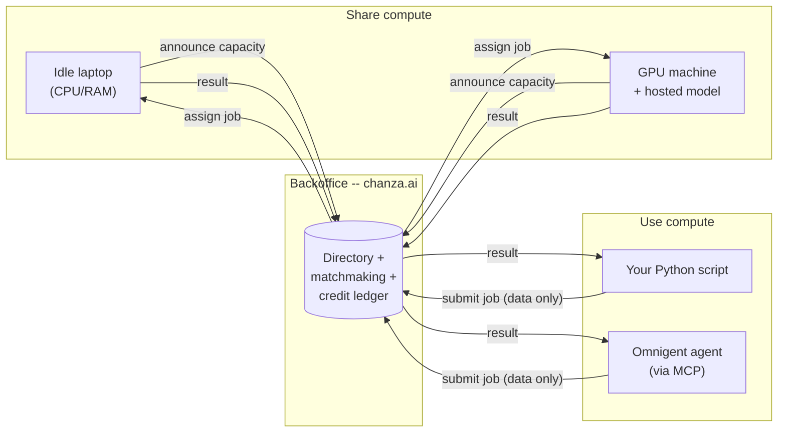
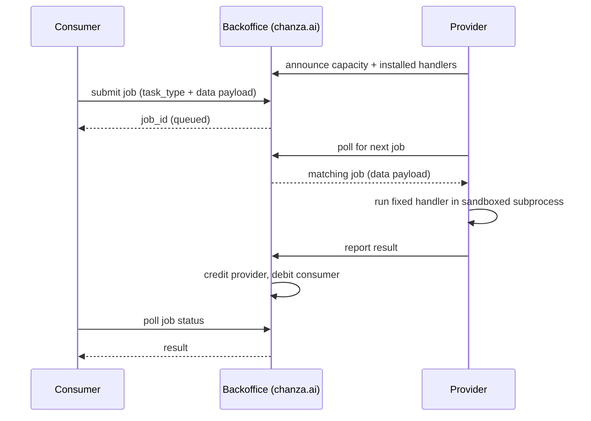
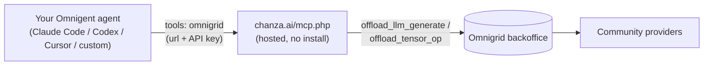

<p align="center">
  
</p>

<h1 align="center">Omnigrid</h1>
<p align="center"><b>Spare compute, shared like a signal -- not sold like a service.</b></p>

<p align="center">
  <a href="https://chanza.ai"><b>Live network &amp; dashboard</b></a> ·
  <a href="https://chanza.ai/register.php">Get an API key</a> ·
  <a href="#works-with-omnigent">Works with Omnigent</a> ·
  <a href="backoffice/HOSTING.md">Self-host it</a>
</p>

---

In 1999, SETI@home let millions of ordinary computers donate their idle
CPU cycles to a single shared goal: sift through radio-telescope noise
for a signal that might mean we're not alone. It worked because giving
away spare compute cost nothing and the ledger of who'd contributed was
public and fair.

Omnigrid borrows that exact idea and points it somewhere new. The thing
worth searching for now isn't a signal from space -- it's more capacity
for the AI agents already running on our own machines. Donate a laptop's
idle CPU/RAM/GPU, or an open model you're already hosting, and it goes to
work for someone else's agent. Need more than your own machine has? Reach
into the same pool. No cloud bill, no plan tiers, no signup form --
installing the client *is* the account.

## The one rule everything else follows

**Nothing here ever runs code that someone else sends you.** A machine
sharing its compute only ever runs its own small set of fixed, pre-installed
functions (matrix ops, ONNX model inference, LLM text generation) on
*data* that arrives over the wire -- never a script, a shell command, or a
container image supplied by whoever's asking. That single rule is what
makes it safe to let a stranger's request run on your laptop at all, and
it's why there's no Docker, no VM, no sandboxing arms race anywhere in
this project: there's no untrusted code to contain in the first place.



## What you can share

Three resources, all optional, all combinable on one machine:

| Resource | What runs on it | How it's used |
|---|---|---|
| **CPU + RAM** | `tensor_op` (matmul/add/multiply/relu/sum/mean), `onnx_infer` (any supplied ONNX model) | Baseline -- every provider offers this, no GPU required. |
| **GPU** | `onnx_infer` and `llm_infer` | Detected automatically and used without extra config -- see below. Not yet wired up for `tensor_op` (still plain CPU numpy there; honest gap, not a hidden one). |
| **An LLM you already have** (any GGUF file -- Llama, Mistral, Qwen, whatever) | `llm_infer` | You host one specific model under a name of your choosing; only prompts and generation params ever cross the wire, never the model itself. |

**How the GPU actually gets used**, concretely:
- `onnx_infer` tries execution providers in order -- **CoreML** (Apple Silicon), then **CUDA** (NVIDIA), then falls back to plain CPU if neither is compiled into the installed `onnxruntime`. This applies automatically to any ONNX job your machine picks up, no flag needed.
- `llm_infer` passes `n_gpu_layers` to `llama.cpp` -- `-1` (offload every layer) by default when a GPU is detected, override with `--gpu-layers` if you want partial offload to save VRAM for something else.
- Verified for real on Apple Silicon: `llama.cpp`'s own device-init log confirms every layer actually lands on the Metal GPU, not just assumed from a flag being set. The CUDA path uses the identical mechanism but hasn't been run on real NVIDIA hardware here -- reports/contributions welcome if you test it.

## What you actually get to call

That's the supply side (what a provider offers). On the demand side, this
is the entire menu -- every one of these is a live network call to
whichever provider currently has that resource:

| Operation | Python (`client_sdk`) | MCP tool (Omnigent/Claude/etc.) | Does what |
|---|---|---|---|
| List what's hosted | -- (check the dashboard) | `list_models` | Names of LLM models currently being shared for free. |
| Generate text | `run_llm_infer(...)` | `offload_llm_generate` | Runs your prompt on a community-hosted model's CPU/GPU. |
| Run a tensor op | `run_tensor_op(...)` | `offload_tensor_op` | matmul/add/multiply/relu/sum/mean on someone's spare CPU. |
| Run an ONNX model | `run_onnx_infer(...)` | -- (Python only for now) | Runs a model *you* supply on someone else's CPU/GPU. |
| Check a slow job | -- (handled for you) | `check_job_result` | Only needed if a job didn't finish immediately -- see below. |

That's the whole surface area. Nothing here is a general-purpose remote
shell or a way to run arbitrary code -- these four operations, and
whatever a provider's own machine decides to do with the data it's handed,
are the entire vocabulary of the network.

## Share your compute

Install the client, tell it how much you're willing to give away, and
leave it running. It only picks up work while your machine looks idle.

```bash
git clone https://github.com/mexmarv/omnigrid.git
cd omnigrid/client
python3 -m venv .venv && source .venv/bin/activate
pip install -r requirements.txt

python3 agent.py --name "your name" --email "you@example.com" --cpu-cores 2 --ram-mb 2048 \
    --coordinator https://chanza.ai
```

Already have an API key from [chanza.ai/register.php](https://chanza.ai/register.php)?
Skip `--name`/`--email` and pass `--api-key` directly instead.

Have an open-weight GGUF model sitting around? Host it for text
generation, GPU offload included automatically:

```bash
python3 agent.py --name "your name" --email "you@example.com" --cpu-cores 2 --ram-mb 2048 \
    --coordinator https://chanza.ai \
    --llm-model-path /path/to/model.gguf --llm-model-name my-model
```

The first run registers you an account (50 free credits to start) and
caches an API key at `~/.omnigrid/` -- no password, ever. Your email is
only used by [reset.php](https://chanza.ai/reset.php) if you ever need to
reissue a lost key or delete the account; back up `~/.omnigrid/` if you'd
rather not rely on that. Every job you complete earns credits from
whoever consumed it; nobody has to trust anybody, the ledger just tracks
who's given what.

<details>
<summary>What actually happens when a job runs (sequence diagram)</summary>


</details>

## Use the network from Python

```python
import client_sdk as cc
import numpy as np

result = cc.run_tensor_op("matmul", a, b, account_name="your name", email="you@example.com",
                           coordinator="https://chanza.ai")

text = cc.run_llm_infer("Explain BitTorrent in one sentence.",
                         model_name="some-hosted-model", account_name="your name",
                         email="you@example.com", coordinator="https://chanza.ai")

# Already have a key from register.php? Skip account_name/email and pass api_key= instead.
```

Check `chanza.ai`'s dashboard (or your own backoffice's `/`) under "Being
shared for free, right now" to see which model names are actually live
before asking for one by name.

---

## Works with Omnigent

<p align="center">
  <a href="https://github.com/omnigent-ai/omnigent"></a>
</p>

[Omnigent](https://github.com/omnigent-ai/omnigent) is Databricks'
open-source meta-harness -- one agent definition, any harness underneath
(Claude Code, Codex, Cursor, and more). Omnigrid was built with Omnigent
specifically in mind: point an Omnigent agent at the hosted MCP endpoint
below and it can reach the whole community-shared network as a tool call,
with nothing to install.



### Wire it up

`backoffice/mcp.php` speaks plain MCP over Streamable HTTP -- it doesn't
care which client is calling, so any MCP-aware tool works, not just
Omnigent. Two steps apply no matter which one you pick:

**1. Get an account and API key.** Visit `https://chanza.ai/register.php`
(or `http://127.0.0.1:8000/register.php` if you're running your own
backoffice -- see [Self-host your own network](#self-host-your-own-network-instead-of-chanzaai)
below), pick a name and email, and you'll get an API key shown once --
save it.

**2. Check what's actually available.** The dashboard lists every model
currently hosted for free under "Being shared for free, right now" --
that's what you ask for by name once it's wired up.

**3. Pick your client** and add the config below (all point at the same
`https://chanza.ai/mcp.php`, or your own backoffice's URL if self-hosting):

<details>
<summary><b>Omnigent</b> -- Databricks' open-source meta-harness</summary>

An agent *is* a YAML file (a `prompt`, an `executor`, and a `tools`
section) -- that YAML is the interface for wiring in external tools. You
either hand-edit it, or describe what you want in any Omnigent chat and
it authors the file for you.

```yaml
name: my_agent
prompt: |
  You are a helpful assistant with access to the Omnigrid community
  compute network via the omnigrid tool.
executor:
  harness: claude-sdk   # or codex, cursor, etc. -- whatever you're already using
  model: your-model-here
tools:
  omnigrid:
    type: mcp
    url: "https://chanza.ai/mcp.php"
    headers:
      Authorization: "Bearer your-api-key"
```

Run it and ask for the shared resource in plain language:

```bash
omnigent run my_agent.yaml
```

> List the models available on Omnigrid, then use whichever one is hosted
> to write a two-sentence summary of why octopuses are considered
> intelligent.

Prefer a local process over the hosted endpoint (fully private setup, no
network hop)? `mcp_server/server.py` does the same tools over stdio --
requires Python + this repo checked out locally:

```yaml
tools:
  omnigrid:
    type: mcp
    command: python3
    args: ["/path/to/omnigrid/mcp_server/server.py"]
    env:
      OMNIGRID_API_KEY: "your-api-key"
      OMNIGRID_HUB: "https://chanza.ai"
```
</details>

<details>
<summary><b>Claude Code</b></summary>

```bash
claude mcp add --transport http omnigrid https://chanza.ai/mcp.php \
  --header "Authorization: Bearer your-api-key"
```

Or add it directly to `.mcp.json` (project scope, shareable via git) or
`~/.claude.json` (user scope):

```json
{
  "mcpServers": {
    "omnigrid": {
      "type": "http",
      "url": "https://chanza.ai/mcp.php",
      "headers": { "Authorization": "Bearer your-api-key" }
    }
  }
}
```
</details>

<details>
<summary><b>Claude Desktop</b></summary>

Remote MCP servers are added through the UI, not a config file:
**Settings &rarr; Connectors &rarr; Add custom connector**, URL
`https://chanza.ai/mcp.php`, then open **Request headers** and add
`Authorization: Bearer your-api-key`. (Team/Enterprise: an org owner adds
it once under **Organization settings &rarr; Connectors**, everyone else
just connects.)

Note: Anthropic's own docs describe custom request-header auth as a beta
feature being rolled out gradually -- if you don't see that option yet,
it may not be enabled for your account.
</details>

<details>
<summary><b>Cursor</b></summary>

Add to `.cursor/mcp.json` (project) or `~/.cursor/mcp.json` (global):

```json
{
  "mcpServers": {
    "omnigrid": {
      "url": "https://chanza.ai/mcp.php",
      "headers": { "Authorization": "Bearer ${env:OMNIGRID_API_KEY}" }
    }
  }
}
```
</details>

<details>
<summary><b>Codex CLI</b></summary>

Add to `~/.codex/config.toml` (or `.codex/config.toml` for a trusted project):

```toml
[mcp_servers.omnigrid]
url = "https://chanza.ai/mcp.php"
http_headers = { Authorization = "Bearer your-api-key" }
```
</details>

<details>
<summary><b>ChatGPT</b></summary>

ChatGPT's connectors (Settings &rarr; Connectors, needs Developer Mode
enabled, paid plans only) do support adding a remote MCP server by URL --
but as far as we could confirm, the UI currently only offers **OAuth or
no authentication**, with no field for a static bearer token or custom
header the way Claude Code/Desktop, Cursor, and Codex CLI all have. That
means there isn't currently a clean way to point ChatGPT directly at
`mcp.php`'s API-key auth. If that's changed or we've got this wrong,
please open an issue -- happy to add real instructions once there's a
supported path.
</details>

**4. Ask for the shared resource by name**, in plain language, in whichever
client you just wired up -- for example:

> List the models available on Omnigrid, then use whichever one is hosted
> to write a two-sentence summary of why octopuses are considered
> intelligent.

The agent calls `list_models` to see what's hosted, then
`offload_llm_generate` to actually run the prompt on the community-shared
GPU/CPU behind it. If the provider is slow to respond, the tool returns a
`job_id` instead of making the agent (or you) wait indefinitely -- the
agent calls `check_job_result` with it, as many times as it takes, until
the answer's ready. Either way, text comes back into your conversation
like any other tool result -- the compute for it just happened on someone
else's machine.

This is *not* a way to share access to your paid Claude/Codex/etc. account
or its credentials -- Omnigent's own session-sharing deliberately keeps
those on your machine, and this integration follows the same rule. It only
ever reaches self-hosted, open-weight models someone chose to donate.

---

## Self-host your own network instead of chanza.ai

The whole backoffice (directory + matchmaking + credit ledger) is plain
PHP, defaulting to SQLite -- one file, nothing to provision, upload it to
any shared host.

```bash
git clone https://github.com/mexmarv/omnigrid.git
cd omnigrid/backoffice
cp config.example.php config.php   # SQLite by default, nothing to edit
php -S 127.0.0.1:8000
```

That's a complete backoffice running locally -- open `http://127.0.0.1:8000`
for the dashboard. Full walkthrough (Hostinger or any shared PHP host,
plus wiring a client against it) in [backoffice/HOSTING.md](backoffice/HOSTING.md).

## Honest limitations -- read before relying on this for anything serious

- **Job results are readable by anyone who knows the job_id.** There's no
  auth on reading a job's payload/result yet via the plain REST API
  (`GET /api/jobs_get.php`); the MCP tools do check ownership, that route
  doesn't yet. Fine for non-sensitive data; don't send anything private
  through the network until this is fixed.
- **No rate limiting.** An account can currently submit as fast as it wants.
- **Reset emails use PHP's built-in `mail()`.** It works out of the box on
  most shared hosting, but deliverability to Gmail/Outlook etc. without
  proper SPF/DKIM records can be spotty. If reset links aren't arriving,
  that's the first thing to check -- not a bug in the reset logic itself.
- **No transport encryption is enforced by the code itself** -- put this
  behind HTTPS (Hostinger's free AutoSSL, or any reverse proxy) before
  running it for real. chanza.ai already does.
- **The LLM handler reloads the model from disk on every job** (each job
  runs in a fresh sandboxed subprocess). Fine for small models; a
  persistent warm worker per model would be the real fix.
- **`tensor_op` doesn't use the GPU yet** -- plain numpy on CPU, even on a
  provider with a GPU sitting idle. `onnx_infer` and `llm_infer` both do;
  extending `tensor_op` (e.g. via PyTorch on CUDA/MPS) is a natural next
  step, not done yet.
- **No redundancy/consensus on results.** A job runs on exactly one
  provider and its answer is taken on faith -- fine when you can sanity-check
  the result yourself, risky if you need to trust a stranger blindly.
- **This has not had an independent security review.** The "never run
  remote code" principle is sound by design, but the implementation
  hasn't been audited. Treat this as a working, tested prototype -- not
  a hardened public service, yet.

## How it's actually built

Providers run a small, fixed set of audited handlers (`client/handlers/`):
`tensor_op` (six safe numpy operations), `onnx_infer` (a supplied ONNX
model, data-only, CoreML/CUDA-accelerated when available), `llm_infer`
(text generation against a model the *provider* chose to host, GPU-offloaded
when available -- the model itself never crosses the wire, only prompts
and generation params do). Every job still runs in its own OS subprocess
with a wall-clock timeout and memory cap, purely to contain crashes -- not
as a security boundary, since there's nothing untrusted to contain.
Accounts authenticate with an API key, never a password -- email is
collected only so `reset.php` can send a one-time link to reissue a lost
key or delete the account. The backoffice enforces that you can only
announce as, or report results for, providers you actually own.

Two ways to reach it as an MCP tool, both exposing the same tools:
`mcp_server/server.py` (Python, stdio, run locally) and `backoffice/mcp.php`
(hosted, HTTP) -- the latter hand-implements the JSON-RPC subset of MCP's
Streamable HTTP transport needed for a stateless tools-only server (no
session state, no SSE), including a from-scratch but numpy-byte-verified
encoder/decoder for the `.npy` tensor format so `offload_tensor_op`'s
payloads are readable by the same Python `tensor_op` handler every other
path uses. Long-running jobs never rely on a host's execution-time limit:
every HTTP request to `mcp.php` stays short (a few seconds) no matter what,
returning a `job_id` to keep polling via `check_job_result` instead of
blocking indefinitely -- verified against real, deliberately slow jobs,
not just fast ones that would hide the problem.
